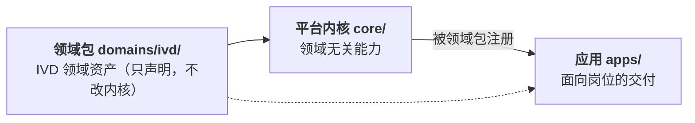

# prjPersonalKnowledgeBase

为一家位于上海的**体外诊断（IVD）试剂贸易公司**，构建「外部政策情报 + 内部经营数据」联动的**知识库 / 决策支持系统**：先用自身经营判断，远期演化为**可复用、可扩展的方法论与业务基础框架**。

## 一、架构三层

- **内核**：采集框架、证据链、本体引擎、消解、映射框架、人审工作台、影响图、治理审计——换行业仍成立。
- **领域包**：本体扩展、编码体系、词典、层级模板、评分卡、价格规则集、术语字典——IVD 是**第一个**领域包。
- **应用**：政策预警、组合健康度诊断、情景推演。

设计理由与预留点见 [讨论 07](discuss/07-平台化预留与渐进明细.md)。

## 二、目录职责

| 路径 | 放什么 | 不放什么 |
|---|---|---|
| `core/` | 平台内核代码（领域无关） | **任何 IVD 字面量** |
| `domains/ivd/` | 领域包：注册表、本体扩展、词典、层级模板、评分卡 | 通用算法 |
| `apps/` | 面向岗位的应用（预警 / 诊断 / 推演） | 领域数据 |
| `docs/` | **定稿的产品文档**（概要设计、详细设计、表结构…） | 讨论过程 |
| `discuss/` | **讨论过程**与决策留痕（含未定结论） | 定稿文档 |
| `discuss/sources/` | 政策原文快照 + 解析后种子数据（**资产，不可变**） | 中间产物 |
| `config/` | 独立配置文件（`config.yaml` 不入库，只提交 example） | 密钥明文 |
| `scripts/` | 一次性运维 / 数据脚本 | 业务逻辑 |

**隔离规则**：`domains/ivd/` 之外不允许出现 IVD 专有字面量；领域包只能通过注册表接入内核。这条规则可用 `grep` 机械检查。

## 三、文档在哪里

| 想看什么 | 去哪 |
|---|---|
| 我在想什么、为什么这么定 | [`discuss/`](discuss/README.md)（过程）+ [`docs/decisions/`](docs/decisions/README.md)（ADR） |
| 系统长什么样 | [`docs/`](docs/README.md)（定稿产品文档） |
| 政策原文与 662 个项目数据 | [`discuss/sources/`](discuss/sources/README.md) |
| IVD 领域资产 | [`domains/ivd/`](domains/ivd/README.md) |

## 四、当前状态

| 层 | 状态 |
|---|---|
| 方法论（01）、业务建模（02）、政策（03）、映射设计（04）、组件图（05） | 🟩 已成文 |
| 模块划分（06）、平台化预留（07） | 🟩 已成文，待评审细节 |
| 项目框架（目录 / 文档体系 / 内核与领域包骨架 / ADR / 校验脚本） | 🟩 已完成 |
| Python 3.12 与 uv 环境 | 🟨 进行中（`.python-version` 已定；待 Git 远端接入后 sync） |
| 代码（内核与领域包实现） | ⬜ 未开始 |
| 数据 | 🟩 已有 662 项目 + 3825 条编码映射；⬜ 缺集采中选清单与 ERP 商品清单 |

## 五、环境与运行

- 解释器 **Python 3.12**（由 `.python-version` 与 `pyproject.toml` 的 `requires-python` 固定，运行时由 uv 管理）；依赖管理用 **uv**（`uv add` / `uv run`），不用 pip / venv / Poetry / conda。
- 依赖按模块实施时逐步引入，**当前 `dependencies` 为空，尚未有可运行代码**；`uv.lock` 提交入库以保证可复现。
- 配置统一从 `config/config.yaml` 读取（复制 `config.example.yaml` 起步）。
- 框架自检：`uv run python scripts/check_framework.py`（目录约定 / 配置 / 文档链接 / 内核隔离性）。

## 六、许可

本项目以 **GPL-3.0** 发布，详见 [LICENSE](LICENSE)；决策理由、约束与依赖许可核对要求见 [ADR 0002](docs/decisions/0002-license-gpl3.md)。

> 产品**以服务形式提供**，软件本体 copyleft 不构成障碍（GPLv3 无网络服务条款）；但**分发软件本体**（客户私有化部署、发布二进制）时须以 GPL-3.0 提供完整对应源码。
