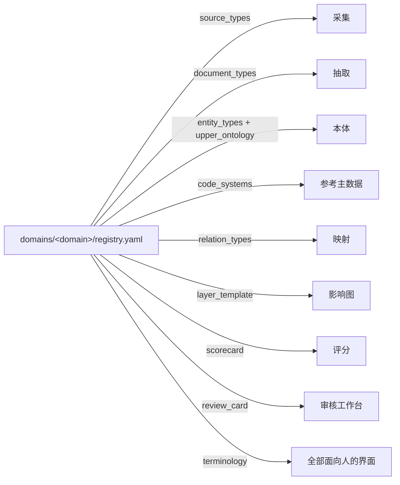

# core/ — 平台内核（领域无关）

> 内核放**换一个行业仍然成立**的能力。IVD 的任何概念（检测项目、注册证、集采、医保编码…）都不许出现在这里。

## 一、模块 → 包名映射

| 模块 | 建议包名 | 一句话职责 | 目录建立时机 |
|---|---|---|---|
| M1 采集 | `core/ingestion/` | 来源驱动抓取、限速重试、附件下载 | 需要抓新来源时 |
| M2 原始层 | `core/source_store/` | 不可变快照 + 元数据 | 第一份新快照时 |
| M3 抽取 | `core/extraction/` | 文档类型注册 → schema 驱动抽取 → 带 span 断言 | M4 定稿后 |
| M4 本体 | `core/ontology/` | 类型系统 + 领域包加载 + 约束校验 | **下一步** |
| M5 消解 | `core/resolution/` | 分桶 → 相似 → 仲裁的流水线框架 | 出现重复实体时 |
| M6 参考主数据 | `core/reference_data/` | 受控词表与编码体系注册的读写 | M6 词典生成时 |
| M7 产品主数据 | `core/entity_master/` | 通用主体对象（组织/产品/证照/地区） | 拿到 ERP 清单时 |
| M8 存储 | `core/storage/` | 统一读写 + schema 版本 + 数据集发布 | 第一张表落地前 |
| M9 映射 | `core/mapping/` | 候选生成 → 打分 → 分层**框架** | V1 纵切时 |
| M10 审核 | `core/review/` | 队列 / 优先级 / 批量分组 / 状态机 | V1 纵切时 |
| M11 规则 | `core/rules/` | 规则版本化、生效与回滚 | 首条规则沉淀时 |
| M12 传导 | `core/impact/` | 分层影响图引擎（层级来自领域模板） | 建第一条 ImpactEdge 时 |
| M13 评分 | `core/scoring/` | 评分卡引擎（维度权重来自领域配置） | V1 纵切时 |
| M14 预警 | `core/alerting/` | 事件 → 订阅规则 → 通知 | 一期末 |
| M15 输出 | `core/delivery/` | 报告模板与视图渲染 | 一期末 |
| M16 回溯 | `core/backtest/` | 历史案例回放与评测 | 一期末 |
| C1 治理 | `core/governance/` | 断言 / 双时态 / 证据链 / 冲突仲裁 / 审计 | 断言表落地时 |
| C2 平台 | `core/platform/` | 配置加载、loguru 日志、调度 | **第一步（所有模块共用）** |

**不预建空目录**：实施到哪个模块再建哪个包目录，避免仓库里出现无内容的骨架。

## 二、内核不变式（四条，违反即架构退化）

1. **零领域字面量**：`core/` 内不出现 `IVD`、`nhsa`、`医保编码`、`检测项目` 等领域词；领域差异只能从注册表读入。
2. **只认注册表形状**：内核代码依赖的是注册表的**结构**（来源、文档类型、编码体系、关系类型、层级、评分卡），不是其中的**内容**。
3. **断言不可变 + 双时态 + 强制证据**：写入只追加；有效时间与事务时间分列；每条断言带原文位置与来源等级。
4. **契约带领域标识**：跨模块数据集必须含 `domain` / `schema_version` / `as-of`。

## 三、内核向领域包要什么（注册表项）



内核不实现这些内容，只实现"**读注册表 → 装配能力**"的逻辑。

## 四、检查隔离性

```bash
# 任何输出都代表隔离被破坏
grep -rniE 'ivd|nhsa|smpaa|医保|检测项目|集采' core/ --include='*.py'
```
