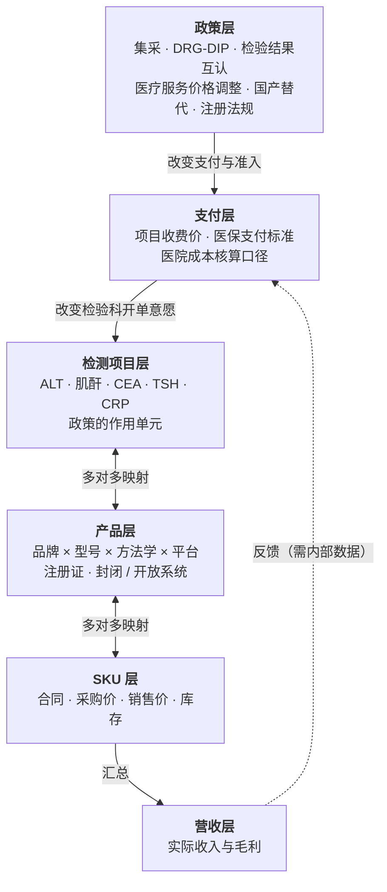

# 02 业务建模：IVD 贸易与六层传导栈

> 领域从「医疗供应链」收敛为「**位于上海的体外诊断试剂贸易公司**」，关心的是：**政策变化与产品组合变化如何影响公司营收**。

## 一、通用层：医疗供应链的建模要点

### 1.1 能力问题（先写问题，再倒推结构）

1. 某药品/项目的**单一来源（sole-source）**程度如何？断供会波及哪些终端品种？
2. 某**原料药（API / Active Pharmaceutical Ingredient，活性药物成分）**产能集中在哪几个国家/工厂？
3. 一张 FDA **警告信**会牵连哪些在售品种与批次？
4. 某治疗领域里有多少关键品种属于高断供风险？
5. 某国**出口管制 / 关税**会改变哪些品种的可及性，传导路径是什么？
6. 过去五年某品种的每次**短缺（Shortage）**，根因链是什么？

### 1.2 五个必须第一版做对的建模决策

| # | 决策 | 原因 |
|---|---|---|
| 1 | **组织用「角色再化」** | 同一家公司可能同时是供应商、生产商、分销商，且角色随时间变。「谁给谁供货」本身带属性（份额、起始、工厂、合同），必须提升为对象。**重要的关系要提升为对象**。 |
| 2 | **时间是一等公民，且双时态** | 监管数据常追溯性更新。只存一个时间戳就无法回答「当时的判断是什么」。 |
| 3 | **别从零造实体本体——对齐现成标准** | 见 1.3。 |
| 4 | **地理必须层级化** | `国家 → 省 → 市 → 园区` 用部分-整体关系（Mereology）建 `PART_OF`，靠传递闭包支持任意粒度聚合。 |
| 5 | **单位与计量规范化** | 写入时归一到规范单位并保留原始值，否则所有数值推理失效。 |

### 1.3 对齐现成标准（重要判断）

**差异化在「关系」，不在「实体」。** 生物医学领域有一整套成熟公开本体，不要重造：

- **RxNorm**（药物规范命名）、**ChEBI**（化学实体）、**UNII / CAS 号**（成分标识）
- **SNOMED CT**（医学系统命名法-临床术语）、**MeSH**（医学主题词表）
- **LOINC**（Logical Observation Identifiers Names and Codes，检验项目国际标准编码）
- **BFO**（Basic Formal Ontology，基础形式本体）与 **OBO Foundry**（开放生物医学本体联盟）
- **GS1 标准**（供应链标识与序列化）、**ISO IDMP**（医药产品标识标准）

公开本体覆盖了「这是什么」，**完全没覆盖「供应链长什么样、风险如何传导」**——精力全部投在后者。

### 1.4 抽取难点与冲突处理

- **文档类型差异极大**：监管文件（模板化）、年报（叙事）、新闻（噪声大）、报关单（表格）需各自的 schema 与 prompt，不要一个 prompt 打天下。
- **年报措辞是防御性的**：大量 "may"、"could"、"we believe"。LLM 极易把可能性抽成事实，**必须在抽取时区分已发生的事实与前瞻性陈述**。
- **区分「报道的事实」与「记者的分析」**，后者可信度低一档。
- **负向证据要谨慎**：「不在短缺列表中」≠「没有短缺」，可能只是没上报。**空缺（absence）的语义在医疗领域特别危险。**
- **冲突处理**：保留多值不强行合并（图库的 `MERGE` 会吃掉冲突）；每条断言带来源等级 + 时间；冲突进仲裁队列。**冲突本身是有价值的信息**（信息不透明 = 风险信号）。

---

## 二、业务理解：这门生意

### 2.1 价值链位置


### 2.2 营收公式

```
营收 = Σ (产品 × 客户 × 价格 × 数量 × 时间)
毛利 = Σ [数量 × (销售价 − 采购价)] − 渠道成本
```

**政策与产品组合变化之所以牵一发动全身，是因为它们同时改动公式里的多个变量**：集采改价格、DRG 改数量、注册证改准入、代理终止改组合结构。

### 2.3 六层传导栈（本体骨架）

政策不直接作用在「你的产品」上，而是作用在「检验项目」上，然后穿透到营收：



名词解释：**集采（集中带量采购）**——医保局牵头，以承诺采购量换大幅降价；**DRG/DIP（按病组/按病种付费）**——医院从「做多少检查收多少钱」变为「一个病组打包付费」，**检验从收入项变成成本项**，对 IVD 影响最深远；**两票制**——从厂家到医院只开两次发票，压缩中间环节；**POCT（Point-of-Care Testing，即时检验）**；**ICL（Independent Clinical Laboratory，第三方独立医学实验室）**。

**为什么必须有这六层**：「产品组合变化」不是产品自己变了，而是**这个映射矩阵的结构变了**。没有中间三层，只能看到「涨了跌了」，看不到「为什么」，更做不了推演。

**IVD 特有的绑定关系必须建进本体**：**仪器平台 ↔ 试剂**。封闭系统（试剂只能用原厂仪器）利润高但绑定深；开放系统价格战激烈。「换不换平台」往往比「换不换试剂」影响大一个量级。

---

## 三、最底层构件设计

### 构件 1：TestItem 检测项目（最重要）

**受控词表**，粒度决定分析粒度。政策作用在这一层。

```
test_item_id / 规范名 / 英文名 / 别名
loinc_code        # LOINC 编码
medical_ins_code  # 医保项目编码（注意各省不同，一对多）
category          # 肝功能 / 肾功能 / 心肌 / 肿瘤标志物 / 激素 / 感染 / 血常规 / 凝血 / 血气
method_class      # 生化 / 免疫 / 分子 / 血液 / 微生物 / POCT
panel             # 所属组套，如「肝功八项」「心肌三项」
clinical_use      # 诊断 / 监测 / 筛查 / 预后
guideline_level   # 指南推荐强度（急诊刚需 vs 可替代）→ 决定 DRG 敏感度
```

- **`panel` 必须有**：医院按组套开单，集采也常按组套打。
- **`method_class` 必须有**：同项目可用不同方法学测（CRP 可免疫可生化），形成**方法学替代关系**——是「产品组合优化」里最有价值的一类判断。

### 构件 2：Product 产品

```
product_id / manufacturer_id / product_name
method_class / platform_id / system_type（封闭 / 开放）
registration_id / price_tier（进口高端 / 进口中端 / 国产高端 / 国产中端 / 国产低价）
```

### 构件 3：Registration 注册证（IVD 特有，不能省）

```
registration_id（NMPA 注册证号）
valid_from / valid_to   # 临期即可售性风险
scope                   # 核准适用范围 → 决定能测哪些项目
change_history
```

### 构件 4：Policy 政策

```
policy_id
policy_type     # 集采 / DRG-DIP / 价格调整 / 检验结果互认 / 国产替代 / 注册法规 / **价格项目规范**
issuer / publish_date / effective_date
scope_region    # 作用地域（集采多为省级联盟，DRG 多为市级试点）
scope_items     # 作用的检测项目 / 组套
mechanism       # 价格 / 数量 / 准入 / 技术标准
intensity       # 强度参数：预期降幅、覆盖比例
source_url / excerpt   # 证据链
```

**`scope_region` 要求同时建 Region 构件**（省 → 市，带层级）。

### 构件 5：ImpactEdge 影响传导边（**系统的发动机**）

```
impact_edge_id
source_type / source_id    # policy 或 tender
target_type / target_id    # test_item 或 product
direction                  # 正向 / 负向
mechanism                  # 价格 / 数量 / 准入 / 技术迁移
magnitude                  # 强度（如价格 -0.6）
lag_months                 # 滞后月数（政策生效到用量变化）
confidence / evidence
```

**把「谁影响谁」做成数据，而不是写在代码或某个人脑子里**——这是整套设计里最关键的一条。它让系统在你不场时也能推演，也让判断错了能被追溯。`lag_months` 必须建：政策发布 → 落地 → 挂网 → 医院执行 → 用量变化通常 3–12 个月，**不建滞后，预警会永远错位**。

### 构件 6：Tender / Listing 招标挂网记录

观测价格的唯一真实入口。哪个平台、哪个项目、哪些产品、什么价、什么时间。

### 构件 7：Score 评分（派生层，不人工维护）

见第五节。

---

## 四、评分模型（统一「预警」与「组合优化」）

**对每个检测项目：**

| 维度 | 方向 | 数据来源 |
|---|---|---|
| 是否已集采 / 在集采计划内 | 负 | 集采公告 |
| 历史同类降幅 | 负 | 历史集采结果 |
| DRG 敏感度（急诊刚需 vs 可选） | 负 | `guideline_level` |
| 是否在互认清单内 | 负 | 卫健委互认清单 |
| 收费价格调整趋势 | 负/正 | 医保局价格文件 |
| 检测量增长趋势 | 正 | 行业报告 |
| 方法学是否处于技术换代 | ± | 行业趋势 |

**对每个产品：**

| 维度 | 方向 |
|---|---|
| 继承所属 `test_item` 的暴露度 | — |
| 国产化压力（同项目国产品牌数量与份额趋势） | 进口负 / 国产正 |
| 平台封闭性 | ± |
| 注册证风险（是否临期） | 负 |
| 该项目可替代品牌数量 | 对议价能力正，对产品独特性负 |

**组合层面：**

- **组合暴露度** = Σ（各产品权重 × 暴露度）。无内部营收时权重用「代理品类数」或「品类市场体量」近似——**这是近似，有偏，要说明**。
- **组合分散度** = 各 `method_class` / `category` 的分布。**全押免疫法就是一个结构性风险**。
- **风口判断** = 暴露度在上升的品类。
- **建议输出**：增配 / 维持 / 减配 / 寻找方法学替代。

---

## 五、最小数据集与验证

### 5.1 最小数据集：宁可小而准

**第一版做 20 个检测项目 × 5 个品牌，人工校对到全对。不要做 2000 个错一半。**

公开数据来源：医保项目目录 / 临床检验项目规范、各省医保局集采公告、卫健委检验结果互认清单、各地 DRG/DIP 细则、NMPA 数据库（注册证）、原厂官网、阳光采购平台（挂网价）、中华医学会各专科分会指南。

20 个项目怎么选：**你实际代理的品类 + 你最担心的品类**。

### 5.2 验证方式：回溯测试（Backtest）——这一步别省

拿已经发生的集采事件当考题：「假设 2023 年江西肝功集采发生时，系统已存在，它能不能标出肝功能类项目高暴露、能不能圈出受影响的产品？」

**这是唯一能把「我觉得有用」变成「已验证有用」的办法**，也是能对外沟通的硬东西。

---

## 六、路线图（三阶段）

| 阶段 | 内容 | 产出 |
|---|---|---|
| **第一阶段（当前）** | 外部情报层 → 暴露度评分 | 代理权组合诊断 + 政策预警 |
| **第二阶段** | 接入订单与成本 → 毛利拆解 | 真正的组合优化 |
| **第三阶段** | 情景引擎 | 「某政策落地，我司营收/毛利影响区间」 |

第二阶段预留、暂不建的构件：**装机量（install base，已投放仪器存量，决定试剂销量）**、**渠道库存与效期**（集采换标造成库存减值）、**账期与垫资**（贸易公司的现金流命门）。

---

## 七、诚实的边界提醒

1. **因果链是「机制模型」，不是「统计模型」，别混。** 政策 → 营收的中间变量多、样本极少（经历过的集采就那么几次），还有疫情、竞争、季节等混杂因素。**用回归拟合「政策对营收的影响」几乎必然过拟合。** 先用专家知识建**传导结构**（定性/半定量），只在数据足够的环节（历史价格-销量）做定量校准。
2. **集采对经销商是双刃剑**：降价是负向，但「量增 + 竞争对手出局 + 集中度提升」是正向。**别只建单向边。**
3. **第一阶段的「产品组合优化」只能给出外部健康度诊断**，真正的「最优组合」（给定成本、账期、销量）**必须等第二阶段接入内部数据**。

---

## 变更记录

| 日期 | 变更 |
|---|---|
| 2026-10-06 | 初稿：合并医疗供应链通用建模 + IVD 贸易业务建模 |
| 2026-10-06 | 价值链、六层传导栈两处 ASCII 图改为 mermaid（见 [05 文档](05-项目组件图.md)） |
