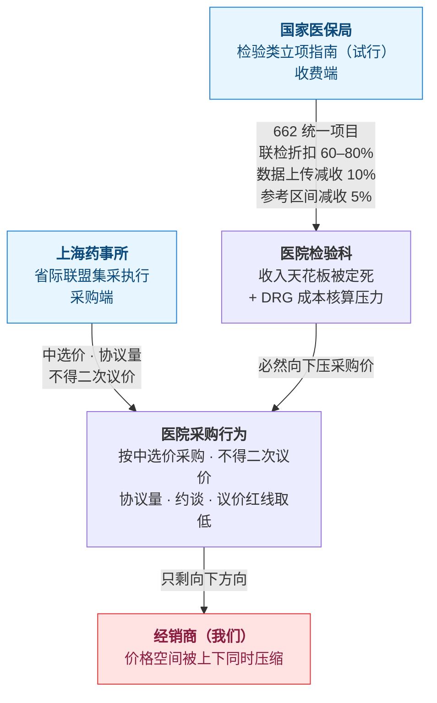
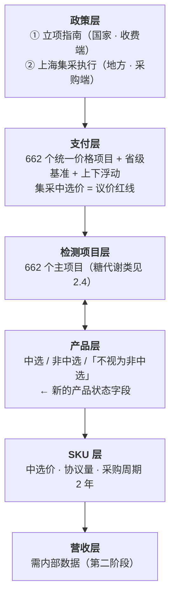

# 03 政策追踪：2026 检验类立项指南与上海集采

> 本轮分析对象：国家医保局《检验类医疗服务价格项目立项指南（试行）》与上海药事所执行省际联盟 IVD 集采结果通知。**这两份文件作用在同一条价值链的两端。**

## 一、两份文件的定位

| | 文件 1 | 文件 2 |
|---|---|---|
| 发布 | 国家医疗保障局，2026-08-14 | 上海市医药集中招标采购事务管理所，2026-08-13，沪药事药械〔2026〕4号 |
| 名称 | 《检验类医疗服务价格项目立项指南（试行）》 | 《关于本市执行省际联盟结构心脏病封堵器、动脉瘤夹、止血材料、高频电刀、体外诊断试剂、糖代谢等生化类检测试剂类医用耗材集中带量采购中选结果的通知》 |
| **管什么** | **收费端**——医院能收多少钱 | **采购端**——医院按什么价买 |
| 状态 | 已发布，**各省价格基准尚未落地** | **2026-08-25 已生效执行** |
| 原始链接 | https://www.nhsa.gov.cn/art/2026/8/14/art_14_21766.html | https://www.smpaa.cn/xxgk/gggs/2026/08/13/23689.shtml |

名词解释：**立项指南**——医保局统一全国医疗服务价格「项目名称、内涵、计价单位」的规范性文件（此前已发布中医、口腔、辅助生殖等多批）；**省际联盟集采**——若干省份联合、通常由一个省牵头组织的带量采购，用承诺采购量换降价。

---

## 二、文件 1 内容要点

### 2.1 规模

将原有价格项目**合并同类项**为 **662 个主项目 + 114 个加收项 + 7 个扩展项**，附《映射关系表》。

**附件 2 的映射表统计（我方解析）：**
- 共 662 个数据行
- 引用 **约 1800 个「医保医疗服务项目」编码**（去重）
- 引用 **约 1752 个「国家卫健委 2023 版技术规范」编码**（去重）

即 **662 个新项目收敛掉了 3500 多个旧编码**。

**下一步**：各省医保局据此制定**全省统一的价格基准**，由有价格管理权限的统筹地区对照基准上下浮动确定实际执行价格。

### 2.2 附件 1 表结构

| 列 | 内容 |
|---|---|
| 序号 | 1..662 |
| 项目名称 | 如「血常规检测费（全血细胞计数和五分类）」 |
| 服务产出 | 该项目做什么 |
| 价格构成 | 价格应涵盖的资源消耗 |
| 加收项 | 差异化收费子项（表中 104 行的此列非空，一个项目可含多个加收项） |
| 扩展项 | 只扩展适用范围、不加价 |
| 计价单位 | 次 / 项 … |
| 计价说明 | **业务规则金矿**，含指标别名与特殊计价规则 |

### 2.3 「使用说明」10 条（**比正文更要紧**）

1. 以**检验指标**为基础设立价格项目。
2. 服务产出相同但操作不同的项目**合并同类项**；各地所定价格为**政府指导价、最高限价，下浮不限**；技术改良可采取「现有项目兼容」方式处理。
3. **「价格构成」** 是省市级医保制定调整价格的**测算因子**，不作为临床技术标准；「设备投入」包括操作设备、器具及固定资产投入。
4. **「加收项」**：同一项目不同方式/场景的差异化收费，加/减收标准由省市级医保制定；同时涉及多个加收项的，以项目单价为基础计算后据实收费。
5. **「扩展项」**：只扩展适用范围、不额外加价，价格按主项目执行。
6. **「基本物质资源消耗」= 试剂（含检测试剂，以及质控液、校准液、固定液等辅助试剂）+ 样本采集器 + 操作器具等，相关成本计入项目价格，不得另行收费。**
7. 要求医疗机构做好**医嘱与价格项目的关联映射，在收费明细中列明具体检验指标**。示例：乙肝两对半按「乙型肝炎病毒抗体检测费」×3 +「乙型肝炎病毒抗原检测费」×2 收费。
8. **联检分档折扣**：一次检验操作对同一份样本多个待测指标联合检测，**≤5 个按 80% 计价，≤10 个按 70%，>10 个按 60%**。但「医疗机构为满足临床医嘱需要，将多个检验项目组合形成的**检验套餐，不属于联检范围**」；同一套餐中符合联检情形的部分按上述规则执行。
9. **所有通过其他检测指标间接计算获得结果的，不得额外收费。**
10. **数据上传减收**：未提供上传数据和存储服务的，每项检验指标**减收 10%，最高不超过 5 元**（血常规、尿常规、粪便常规、血气分析同时覆盖多个指标的，整体按一项指标执行）。**参考区间减收**：血常规（全血计数+五分类）、血小板计数、红细胞比积、血红蛋白、红细胞参数平均值、白细胞分类计数、丙氨酸氨基转移酶、天门冬氨酸氨基转移酶、碱性磷酸酶、γ-谷氨酰基转移酶、总蛋白、白蛋白、钾、钠、氯、乳酸脱氢酶、肌酸激酶等项目，上传数据所用参考区间与已出台行业标准（分成人和儿童）不一致的，**每项减收 5%**；单次医嘱涉及多项指标的，累计减收不超过 5 元。

### 2.4 与糖代谢集采直接相关的项目（供参照）

| 序号 | 项目名称 |
|---|---|
| 235 | 葡萄糖检测费 |
| 236 | 葡萄糖末梢血即时检测费 |
| 238 / 239 / 240 | 半乳糖 / 果糖 / 木糖检测费 |
| 243 | 乳酸检测费 |
| 333 | 糖化血红蛋白检测费 |
| 338 | 糖化白蛋白检测费 |
| 339 | 糖化血清蛋白检测费 |
| 340 | 晚期糖基化终产物检测费 |
| 395 | C肽检测费 |
| 396 | 胰岛素检测费 |
| 397 | 胰岛素原检测费 |
| 398 | 胰高血糖素检测费 |
| 644 | 糖尿病自身抗体检测费 |

---

## 三、文件 2 内容要点

### 3.1 时间线

| 时间 | 事件 |
|---|---|
| 2026-07-28 | 产品信息经国家医保招采子系统发布（**需登录，公开网页无**） |
| 2026-08-13 | 上海药事所发文 |
| **2026-08-25** | **生效执行** |

- 采购周期：**体外诊断试剂、糖代谢等生化类检测试剂 = 2 年**（结构心脏病封堵器至 2028-12-31）
- 依据：国医保办〔2021〕31号、沪医保价采〔2024〕14号

### 3.2 关键规则

- 医疗机构**按中选价采购，不得进行任何形式的「二次议价」**
- **本市现行价格低于中选价的，须继续按本市现行价格作为中选价采购**
- 「不视为非中选」标识产品：以省际联盟牵头省份下发采购清单内价格作为议价红线，**与本市现行议价红线两者取低**
- 采购使用量**不低于中选产品的协议采购量**；提前完成协议量的，超出部分仍按中选价
- 执行三个月后可查进度，市药事所对进度不理想的医疗机构**提示或约谈**，系统按已验收发票统计
- 非中选产品按本市现行议价挂网规定执行
- 回款：原则上不超过使用之日起的**次月底**

---

## 四、核心判断：上收下压的双向挤压



### 六条传导机制

1. **试剂成本进价格构成 = 采购价天花板被锁定。** 医院收的检验费已包含试剂成本且禁止另行收费，**医院不可能按超过「价格构成里试剂份额」的价去采购**。集采压你的进货价，立项指南定医院收费上限，**中间的渠道利润被方程式限定，不是靠谈判争来的**。
2. **联检折扣是结构性利空。** 一管样本检出指标越多，打折越狠（60%）。但第 8 条留了口子：**「检验套餐不属于联检」**——套餐不打折、联检打折。这个界线**既是产品设计空间，也是合规风险点**。
3. **数据上传能力变成价格要素。** 不能上传/存储数据，每项减收 10%。**这是新的准入门槛，也是可向客户提供的增值服务点**。
4. **参考区间不一致 = 让医院少收钱。** 18 个指定项目若未对齐行业标准，每项减 5%。代理老注册证产品需注意。
5. **方法学溢价空间被合并掉。** 原来按方法学分设的收费项目被合并，医院不再因「用某方法学」多收钱。
6. **662 个新编码 = 医院的系统改造工程。** 医院要做医嘱、收费、LIS 三方映射重构——**既是服务切口，也意味着自己的产品目录必须跟着重建映射**。

**上海特有**：「本市现行价低于中选价的按现行价」+「议价红线两者取低」= **没有任何向上空间，只有一个向下方向**。

---

## 五、时间紧迫性（重要）

抓取服务端返回的当前时间为 **2026-10-06**：

- **上海集采已生效 6 周**（2026-08-25 生效）——不是「将要发生」，而是**已经发生，正在挤占份额**。
- **立项指南的上海价格基准尚未落地**——这是正在路上、还没打到的**第二波**。

**因此「提前预警」真正该盯的目标物是：上海依据立项指南出台检验类价格项目基准的那一刻。** 同时，现在正是把它建成模型的窗口期。

---

## 六、由本政策引出的构件修改

**好消息**：这两份文件把「最底层构件」里最难啃的两块**免费给齐了**：

| 原以为的苦活 | 现状 |
|---|---|
| 构件 1「检测项目主数据」需自己造 | 662 个官方项目定义就在附件 1 |
| 跨体系标识映射表是长期的资产 | 附件 2 直接给了「新项目 ↔ 1800 个医保编码 ↔ 1752 个卫健委 2023 编码」的官方映射 |

**需新增的字段与对象：**

| 位置 | 新增内容 |
|---|---|
| `TestItem` | 医保医疗服务项目编码、国家卫健委 2023 技术规范编码、计价单位、服务产出、价格构成 |
| `TestItem` | **是否落入联检折扣范围**、**是否在参考区间减收清单内**、**是否要求数据上传**（三个风险标记位） |
| `Product` | **集采状态**：中选 / 非中选 /「不视为非中选」/ 未纳入 + 中选价 + 协议量 + 周期起止 |
| 新增对象 | `PriceRuleSet` 价格规则集（联检折扣、数据上传减收、参考区间减收、间接计算不另收） |
| 新增对象 | `Tender` 集采批次（2026 省际联盟 IVD 集采，上海执行，周期 2 年） |
| `Policy` 子类型 | 新增「**价格项目规范**」类（区别于「集采」） |

**映射到六层传导栈：**



---

## 七、数据获取方式（复现用）

### 国家医保局（可直接抓取）

```
curl -sL -A "Mozilla/5.0 ..." "https://www.nhsa.gov.cn/art/2026/8/14/art_14_21766.html"
```

xlsx 附件地址写在页面 `<meta name="Image" content="...">` 里：

```
http://www.nhsa.gov.cn/module/download/downfile.jsp?classid=0&filename=<hash>.xlsx
```

下载时需带 `-e <文章页URL>` 作 referer。

### 上海药事所（有反爬）

- smpaa.cn 使用**加速乐（jiasule）/ 知道创宇云防御**，部分页面返回拦截页或 403。
- 有效做法：带正常浏览器 UA + `-e` 参考页 + **失败重试**；多数页面重试后可通。
- 栏目列表（结果公布）：`https://www.smpaa.cn/xxgk/gggs/index_zhongbiao.shtml`
- **7 月 28 日的中选产品清单不在公开网页**，需登录国家医保招采子系统「医药管理-公告管理-公告信息查询」。

### xlsx 解析（本机做法）

无需第三方库：xlsx 是 zip，读 `xl/worksheets/sheet1.xml` 即可；本文件字符串为 `inlineStr` 内联，**无 `sharedStrings.xml`**。注意附件 1/2 的**前几行是标题与表头**，真实数据从第 3/第 5 行开始，且**末尾有一行「使用说明」不是数据**。

---

## 八、缺口与待确认

1. **中选企业与中选价格清单**——需登录系统下载，公开网页无。**这是整个分析的核心输入。**
2. **省际联盟的牵头省份**是哪个。
3. 公司代理品牌在这两个集采品类（IVD 试剂、糖代谢等生化类检测试剂）中的中选情况。
4. 公司主力品类是否集中在糖代谢 / 生化。

---

## 变更记录

| 日期 | 变更 |
|---|---|
| 2026-10-06 | 初稿：两份政策原文要点 + 影响分析 |
| 2026-10-06 | 双向挤压、传导栈映射两处 ASCII 图改为 mermaid（见 [05 文档](05-项目组件图.md)） |
