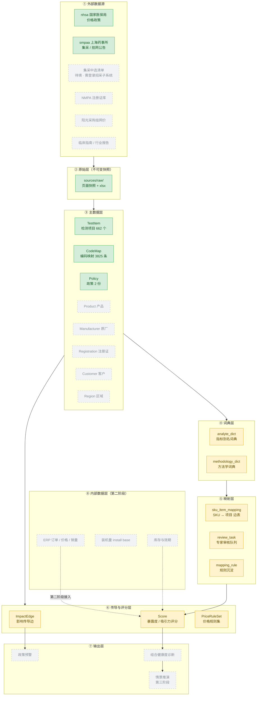
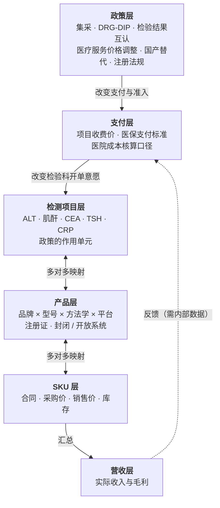
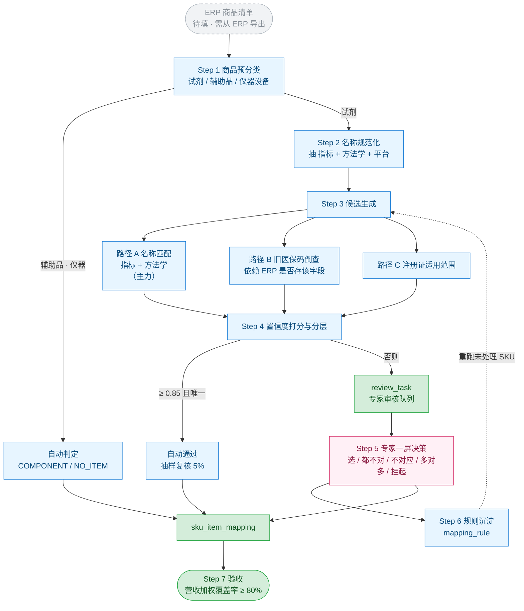
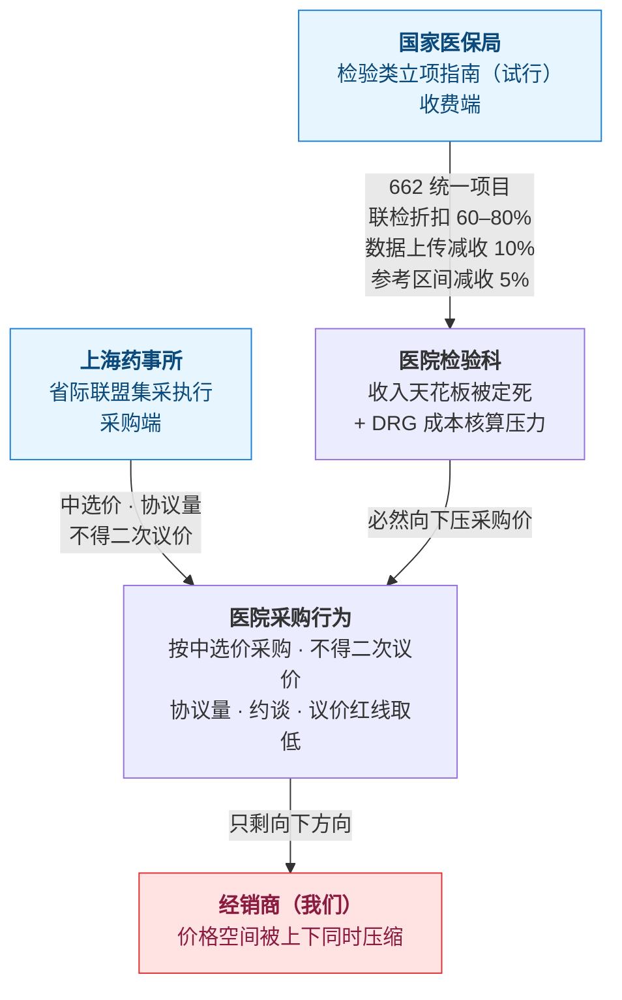

# 05 项目组件图

> 本图反映**当前讨论进度**：已落地的、已设计待实施的、以及尚未确定的节点。
> 未确定的节点以**虚线灰底**标出，并在文末「待填节点清单」里说明缺什么。

## 图例

| 样式 | 含义 |
|---|---|
| 🟩 绿底实线 | **已落地**——数据或文件已存在于本仓库 |
| 🟨 黄底实线 | **设计完成，待实施**——表结构/流程已定，尚无数据或代码 |
| ⬜ 灰底虚线 | **待填**——尚未讨论清楚，或依赖外部信息才能确定 |

---

## 图 A：项目组件总览

---

## 图 B：六层传导栈（本体骨架）

政策不直接作用在产品上，而是作用在**检验项目**上，再穿透到营收。

---

## 图 C：SKU ↔ 检测项目映射流程

---

## 图 D：两份政策对经销商的双向挤压

---

## 待填节点清单

按「补齐所需的信息」分组。**打 ✅ 的是已经拿到答案、只是尚未落数据的。**

### 依赖外部信息（当前拿不到）

| 节点 | 缺什么 | 怎么补 |
|---|---|---|
| ⬜ 集采中选清单 | 中选企业与中选价格 | 登录国家医保招采子系统「医药管理－公告管理－公告信息查询」下载；**这是最大缺口** |
| ⬜ 省际联盟牵头省份 | 牵头省是谁 | 同上，或集采文件正文 |
| ⬜ 阳光采购挂网价 | 上海现行挂网价 | 阳光采购平台，公开但需逐条查 |

### 依赖你方提供（已列出字段清单，待交付）

| 节点 | 缺什么 | 补法 |
|---|---|---|
| ⬜ ERP 商品清单 | 商品编码 + 名称 + 原厂 + 注册证号 | 按 [04 文档](04-数据工程-SKU与检测项目映射.md) 第九节导出（可脱敏） |
| ⬜ `Product` 产品 | 同上 | 由映射流程产出 |
| ⬜ `Manufacturer` 原厂 | 品牌归一化 | 由 ERP 商品名抽取 |
| ⬜ `Registration` 注册证 | 注册证号 + 有效期 + 适用范围 | ERP 字段或 NMPA 数据库 |
| ⬜ `Customer` 客户 | 客户结构（公立医院 / ICL 占比） | 第二阶段 |
| ⬜ `Region` 区域 | 省 → 市层级 | 结构已定，数据待补 |
| ⬜ ERP 订单 / 价格 / 销量 | `revenue_weight` 等 | 第二阶段接入 |

### 已设计、等实施（不是待填，是待建）

| 节点 | 状态 |
|---|---|
| 🟨 `analyte_dict` / `methodology_dict` | 表结构已定；语料来自附件 1「计价说明」列 |
| 🟨 `sku_item_mapping` / `review_task` / `mapping_rule` | 表结构已定，见 04 文档第四节 |
| 🟨 `ImpactEdge` / `Score` / `PriceRuleSet` | 设计已完成，见 02 文档第三节构件 5 |
| ⬜ 输出层（政策预警 / 组合诊断 / 情景推演） | 形态未定，取决于第一版映射产出什么 |

### 需要你决策才能定稿

| 节点 | 待决 |
|---|---|
| ⬜ 存储选型 | 关系型起步 vs 图数据库（见 [01 文档](01-总体方向与架构选型.md) 第四节，倾向关系型 + 边表起步） |
| ⬜ 输出层形态 | 看板 / 问答 / 报告，取决于「预警」和「组合诊断」你更想要哪种交付 |
| ⬜ `Product.集采状态` | 中选 / 非中选 / 不视为非中选 三态由中选清单决定，清单到手才能落 |

---

## 变更记录

| 日期 | 变更 |
|---|---|
| 2026-10-06 | 初稿：组件总览、六层传导栈、映射流程、政策双向挤压 4 张图 + 待填清单 |
