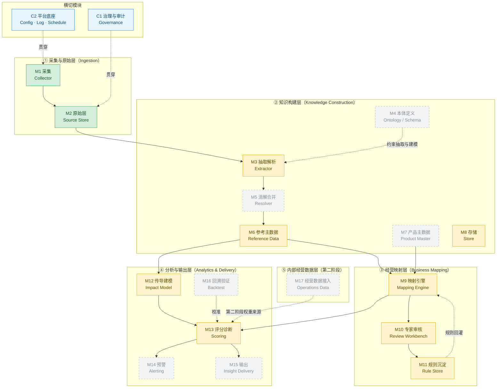
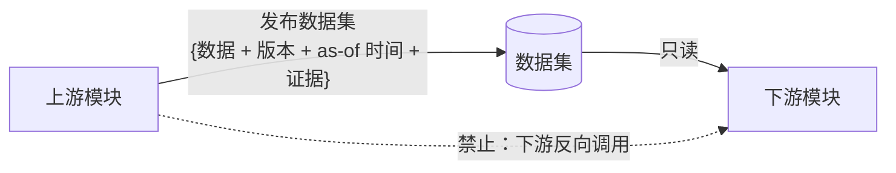
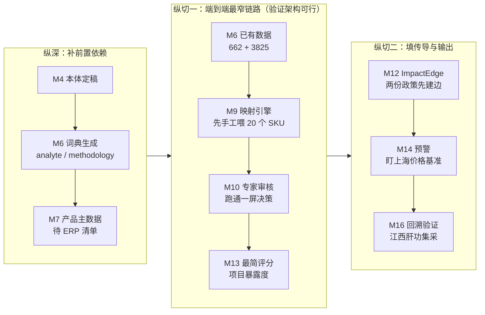

# 06 功能模块设计

> **本文只回答四件事**：有哪些模块、每个模块干什么、边界在哪、按什么顺序做。
> **本文不含**表结构（见 [04](04-数据工程-SKU与检测项目映射.md)）与实现细节（选型见 [01](01-总体方向与架构选型.md)）。
> 目的：在写任何一行代码前固定**模块边界**，使后续每一步只动一个模块、只改一处。

## 一、设计原则

| # | 原则 | 说明 |
|---|---|---|
| 1 | **依赖单向** | 上游模块不知道下游存在。下游只读上游**已发布的数据集**，不反向调用。 |
| 2 | **契约只走数据集** | 模块间**不允许跨模块直接读对方内部表**。每个模块对外的只有「它发布的数据集 + 版本号 + as-of 时间」。 |
| 3 | **可单独重跑** | 任一模块失败或规则变更，只重跑该模块，不动上游（上游不可变）。 |
| 4 | **数据不可变 + 版本化** | 上游数据只追加不改写；修正靠发布新版本。这是"回溯测试"与"当时我们以为是什么"的前提。 |
| 5 | **人在环是一等模块** | 专家审核不是"后台管理页"，是独立模块（M10），有自己的队列、优先级、状态机、产出物。 |
| 6 | **机器给候选、人给结论** | 凡是"机器猜的"必须带置信度与状态，未确认的结论不得进入对外输出（M13/M15 只消费已确认数据）。 |

## 二、分层视图

## 三、模块清单（总表）

| 编号 | 模块 | 一句话作用 | 关键实体 | 阶段 |
|---|---|---|---|---|
| M1 | 采集 Collector | 把外部政策/价格/注册信息**抓下来** | 抓取任务、页面、附件 | 一期 |
| M2 | 原始层 Source Store | **不可变快照 + 元数据**，可重放 | 原始文档、来源、抓取时间 | 一期 |
| M3 | 抽取解析 Extractor | 非结构化 → **结构化 + 原文位置证据** | 候选实体/断言 | 一期 |
| M4 | 本体定义 Ontology | 定义**类/属性/关系/约束**，同时充当抽取提示词 | 类型定义、正例反例 | 一期 |
| M5 | 消解合并 Resolver | 判断**多个指称是否同一实体** | 合并决策、别名 | 一期 |
| M6 | 参考主数据 Reference Data | 检测项目/编码映射/地区/词典的**权威版本** | TestItem、CodeMap、Region、词典 | 一期 |
| M7 | 产品主数据 Product Master | 产品/原厂/注册证的**规范身份** | Product、Manufacturer、Registration | 一期（依赖 ERP） |
| M8 | 存储 Store | 统一读写入口 + **schema 版本管理** | 数据集发布版本 | 一期 |
| M9 | 映射引擎 Mapping Engine | SKU ↔ 检测项目**候选生成与打分** | 映射候选、置信度 | 一期 |
| M10 | 专家审核 Review Workbench | 人**一屏决策**，把候选变结论 | 审核任务、决策 | 一期 |
| M11 | 规则沉淀 Rule Store | 专家决策 → **可复用规则**，反哺 M9 | 映射规则 | 一期 |
| M12 | 传导建模 Impact Model | 把「谁影响谁」**做成数据** | ImpactEdge、PriceRuleSet | 一期 |
| M13 | 评分诊断 Scoring | 暴露度/吸引力/组合健康度（**派生层**） | 评分、组合诊断 | 一期 |
| M14 | 预警 Alerting | 事件 → 订阅规则 → **通知** | 预警规则、预警事件 | 一期后段 |
| M15 | 输出 Insight Delivery | 报告 / 看板 / 问答的**交付形态** | 报告、视图 | 一期后段 |
| M16 | 回溯验证 Backtest | 用历史集采**验证模型有用** | 回溯用例、评测结果 | 一期后段 |
| M17 | 经营数据接入 Operations Data | ERP 订单/价格/销量/装机/库存 | 经营事实 | 二期 |
| C1 | 治理与审计 Governance | 证据链、可信度、冲突仲裁、审计日志 | 断言、审计记录 | 贯穿 |
| C2 | 平台底座 Platform | 配置、日志、调度、任务编排 | 配置文件、运行日志 | 贯穿 |

## 四、模块归属：内核 / 领域包 / 应用

06 的 17 个模块不是平铺的——按 [07 文档](07-平台化预留与渐进明细.md) 的三层归属如下（这是**边界纪律**，不是分类学）：

| 归属 | 模块 | 说明 |
|---|---|---|
| **平台内核 `core/`** | M1–M5、M8、M9–M16（**框架部分**）、C1、C2 | 换行业仍成立 |
| **领域包 `domains/ivd/`** | M6、M7（**内容部分**）；层级模板、评分卡、价格规则集、词典、术语字典、审核卡片字段 | IVD 专属资产，只声明不改内核 |
| **应用 `apps/`** | 专家审核台、政策预警、组合健康度诊断、情景推演 | 组装内核与领域包，面向岗位 |

**几个需要点明的分界**（同一模块两侧都有）：

| 模块 | 内核负责 | 领域包负责 |
|---|---|---|
| M6 参考主数据 | 受控词表与编码体系的**读写机制** | 有哪几个编码体系、词典内容（662 项目、3825 映射） |
| M7 产品主数据 | 通用主体对象（组织 / 产品 / 证照 / 地区） | "注册证"这一概念的具体字段与语义 |
| M9 映射 | 候选生成 → 打分 → 分层的**框架** | 要素抽取器、词典、打分权重、关系类型集 |
| M10 审核 | 队列 / 优先级 / 批量分组 / 状态机 | 卡片上显示哪些字段（怎么让专家看得懂） |
| M12 影响图 | 分层图引擎与遍历 | **六层是哪六层**（`layer_template.yaml`） |
| M13 评分 | 评分卡引擎 | 维度、权重、阈值（`scorecard.yaml`） |

**因此规则的表述要精确**：不是"某个模块属于内核或领域包"，而是**能力在内核、内容在领域包**。

## 五、逐模块职责说明

### ① 采集与原始层

**M1 采集 Collector**
- **作用**：按来源把外部信息拿下来并登记。目前涉及 nhsa（可直接抓）、smpaa（有加速乐反爬，需重试）、后续 NMPA / 阳光采购 / 招采子系统。
- **边界**：只负责"**拿到原件**"，不做解析、不做判断。反爬策略、重试、referer、限速属于本模块。
- **输入**：来源清单（配置驱动，非硬编码）。
- **输出**：原始文件 + 抓取元数据（URL、时间、UA、状态码、重试次数）。
- **注意**：招采子系统内网/登录页属于**人工介入流程**，本模块只登记"已由人工下载"的文件，不做自动化登录。

**M2 原始层 Source Store**
- **作用**：原始文档**不可变归档**，带来源/时间/可信度。换模型、改本体时必须能重跑。
- **边界**：只追加，不修改；是所有分析的**唯一事实底座**。
- **输出**：`raw/` 快照（现已存在 4 份）。

### ② 知识构建层

**M3 抽取解析 Extractor**
- **作用**：把原始文件变成结构化候选。xlsx 用确定性解析，长文本用 LLM 结构化输出。
- **边界**：**每条抽出的断言必须附带原文位置（span）**；本模块只产出"候选"，不拍板。不同文档类型用不同 schema 与提示词。
- **输出**：候选实体与候选断言 + 证据片段。

**M4 本体定义 Ontology / Schema**
- **作用**：用 YAML/JSON 定义类、属性、关系、约束，进版本控制；**每个类型写定义 + 正例 + 反例**，直接当 LLM 抽取提示词用。
- **边界**：管**模式层**（T-Box），不管实例数据（A-Box）。它是 M3 的输入约束，不是运行时代码。
- **现状**：目前只散落在 02 文档的构件描述里，**尚未形成正式文件**——这是 M3/M12 开工前的实际前置依赖。

**M5 消解合并 Resolver**
- **作用**：判断多个指称是否同一实体（同一原厂的不同写法、同一指标的不同别名）。流水线：字符串相似 → 分桶 → 向量 → 图结构 → LLM 仲裁 → 人工确认。
- **边界**：**保留多值，不强行合并**；冲突进仲裁队列（冲突本身是情报，见 02 文档 1.4）。
- **产出**：别名表 + 合并决策记录。

**M6 参考主数据 Reference Data**
- **作用**：存放**外部权威且相对稳定**的主数据：`TestItem`（662）、`CodeMap`（3825）、`Region`（省→市层级）、`analyte_dict`、`methodology_dict`。
- **边界**：只进外部权威数据与词典，**不放公司内部商品**（那是 M7）。
- **现状**：`TestItem` / `CodeMap` **已有数据**（`sources/parsed/`）；两个词典**表结构已定、语料在手、待生成**。

**M7 产品主数据 Product Master**
- **作用**：建立公司视角的规范产品身份：`Product`（品牌×型号×方法学×平台）、`Manufacturer`（原厂归一）、`Registration`（注册证号/有效期/适用范围）。
- **边界**：**数据来源是 ERP 商品清单**，本模块负责规范化，不负责与检测项目建立关系（那是 M9）。
- **阻塞**：依赖你方按 04 文档第九节交付 ERP 商品清单。

**M8 存储 Store**
- **作用**：统一读写入口 + schema 版本管理 + 数据集发布。
- **边界**：**不放业务逻辑**；只做存取、事务、迁移。
- **选型**：倾向关系型起步 + 显式边表（待你拍板，见 01 文档第四节）。

### ③ 经营映射层（本项目**真正的差异化所在**）

**M9 映射引擎 Mapping Engine**
- **作用**：把 ERP 商品映射到 662 个检测项目。7 步流程中的 1–4 步：商品预分类 → 名称规范化与要素抽取 → 三路候选生成 → 置信度打分分层。
- **边界**：**只出候选和理由，不给答案**（答案可信度无法验证）。辅助品/仪器自动判定为 `COMPONENT`/`NO_ITEM`，**不进专家队列**。
- **输出**：映射候选 + 分数 + 命中证据。

**M10 专家审核 Review Workbench**
- **作用**：公司内部产品/商务专家「一屏决策」。左侧商品全貌、中间 Top-3 候选（含服务产出与计价说明）、右侧五选一操作（选 / 都不对 / 不对应 / 多对多 / 挂起）。
- **边界**：**界面必须用业务语言**，不出现"加收项""联检折扣"这类政策术语；按 `revenue_weight` 排优先级，**不按编码排**。
- **关键**：「不确定 → 挂起转交」这条必须有，否则专家会硬选、污染数据。

**M11 规则沉淀 Rule Store**
- **作用**：专家确认的决策转成可复用规则（名称模式/指标/方法学/类别），重跑未处理 SKU，迭代至队列清空。
- **边界**：规则生效前需可见、可回滚、带命中计数；规则**不能覆盖专家已确认的结论**。
- **价值**：这是把一次性人工投入变成**资产**的地方。

### ④ 分析与输出层

**M12 传导建模 Impact Model**
- **作用**：把「谁影响谁」做成数据（`ImpactEdge`：方向/机制/强度/滞后月数/置信度/证据），并维护 `PriceRuleSet`（联检折扣、数据上传减收、参考区间减收、间接计算不另收）。
- **边界**：**机制模型，不是统计模型**。写规则靠专家知识，定量校准只在数据足够的环节做。
- **注意**：`lag_months` 必须建——不建滞后，预警永远错位。集采对经销商是双刃剑，**别只建单向边**。

**M13 评分诊断 Scoring**
- **作用**（派生层，不人工维护）：项目暴露度、产品暴露度、组合暴露度/分散度/风口判断，输出"增配/维持/减配/找方法学替代"。
- **边界**：**只消费已确认映射与已确认传导边**；无内部数据时权重用近似（代理品类数/市场体量），**必须标注"这是近似、有偏"**。

**M14 预警 Alerting**
- **作用**：把"上海出台检验类价格基准"这类**事件**，按订阅规则匹配受影响的品类/产品，推给人。
- **边界**：预警不产生结论，只产生**提示 + 证据链接**。

**M15 输出 Insight Delivery**
- **作用**：交付形态层——报告 / 看板 / 问答。
- **边界**：形态未定（待你决定，见第九节）。

**M16 回溯验证 Backtest**
- **作用**：拿已发生的集采（如 2023 年江西肝功集采）当考题，检验系统能否标出高暴露品类、圈出受影响产品。
- **边界**：这是**唯一能把「我觉得有用」变成「已验证有用」**的模块，也是能对外沟通的硬东西。

### ⑤ 内部经营数据层（第二阶段）

**M17 经营数据接入 Operations Data**
- **作用**：接入 ERP 订单/价格/销量、装机量（install base）、库存与效期、账期垫资。
- **边界**：**第一阶段完全不碰**。接入方式与脱敏口径需单独设计。
- **影响**：它一旦接入，M13 的权重从"近似"变成"真实"，组合优化才成立。

### 横切模块

**C1 治理与审计 Governance**——断言带来源等级与时间、可信度分级、冲突仲裁队列、实体合并确认、审计日志。**贯穿所有层**，不是独立流水线阶段。

**C2 平台底座 Platform**——配置集中在独立配置文件（跟随项目既有约定，如 `config.yaml`）、日志统一 loguru、任务调度与抓取限速。**所有模块共用**，不重复实现。

## 六、模块间契约（三条硬规则）

1. **只发布数据集，不暴露内部表**。下游读"某某数据集 v3（as-of 2026-10-06）"，而不是读某张表。
2. **契约含时间**。任何跨模块数据必须带 `as-of`，否则回答不了"当时我们以为是什么"。
3. **契约含证据**。跨模块流动的结论必须能回溯到 `sources/raw/` 里的原始位置。

## 七、实施顺序：一期纵切优先

**为什么先纵切**：横着把 M1–M8 每层做全，会花很久才看到第一个能用的东西；**先让一条最窄的链路从数据走到结论**，架构问题会立刻暴露。注意 V3 的 M4/M6 词典其实是 V1 的前置——它们成本最低、见效最快。

## 八、明确不做（划界）

| 不做 | 原因 |
|---|---|
| 实时流式接入 | 政策按月更新，批处理足够 |
| 自动化登录招采子系统 | 登录态与合规风险不值当，人工下载 + 登记即可 |
| OWL/RDF 推理 | 工程重、对 LLM 不友好（见 01 文档第 2 节） |
| 第一版上图数据库 | 关系型 + 边表就是图，够用 |
| 第一版对外 API / 多租户 | 先自用，远期再谈产品化 |
| 全量 SKU 映射 | 营收加权覆盖 80% 即可上线，不为长尾拖延 |

## 九、待你确认的开放问题

1. **本模块划分本身**：是否认可这 17 + 2 个模块的边界？有没有该合并/该拆分的？
2. **M4 本体的定位**：是否同意"先出正式本体文件（YAML/JSON），再开工 M3/M9"？它现在只存在于 02 文档的叙述里。
3. **一期输出形态（M15）**：报告 / 看板 / 问答，先做哪个决定 M13 的产出长什么样。
4. **存储选型（M8）**：确认"关系型 + 边表起步"？（01 文档倾向，但需你拍板）
5. **M7 前置**：ERP 商品清单何时能给？它决定 M9 何时能启动。

---

## 变更记录

| 日期 | 变更 |
|---|---|
| 2026-10-06 | 初稿：5 层 + 2 横切的 17 个功能模块、职责边界、契约规则、实施顺序 |
