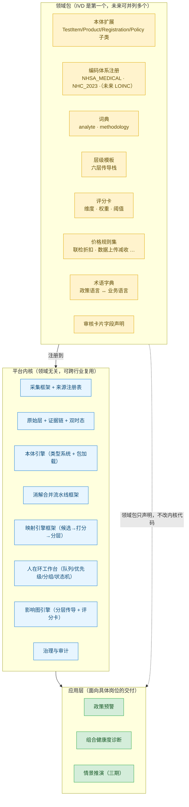
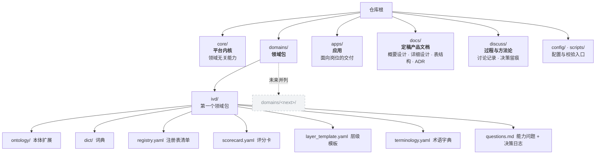

# 07 平台化预留与渐进明细

> **诉求**：现在定义在 IVD（体外诊断）试剂贸易领域，但未来要能形成**可复用、可扩展的方法论与业务基础框架**。
> **本文回答**：在这个诉求下，哪些东西必须**现在就考虑好、留出位置**，哪些必须**现在忍住不做**。
> **方法**：渐进明细（Progressive Elaboration）——按"已验证的复用需求"逐层抽象，而不是按想象预建框架。

## 一、两个对称的失败模式

| 失败模式 | 表现 | 后果 |
|---|---|---|
| **过早具体** | IVD 的业务字段写死在采集器、评分公式、界面里 | 第二个领域来了要重写，方法论无法沉淀 |
| **过早抽象** | 现在就去设计插件协议、工作流引擎、通用图算法库 | 没有第二个实例做验证，抽象必然错；开发速度归零 |

**所以本文的目标不是"现在就抽象"，而是"现在就隔离"。** 隔离是低成本的、确定有益的；抽象是高成本的、需要证据的。

## 二、判断标准：什么进内核，什么留领域包

一条内容放内核还是放领域包，用四条判据，**四条全中才进内核**：

1. **领域无关性**：换一个行业，这句话还成立吗？（"证据必须附原文位置"成立；"试剂要绑注册证"不成立）
2. **变更频率低**：内核的东西半年不改，领域的东西随业务月月改。
3. **已有或即将有第二实例**：至少能想象出第二个领域里的对应物。
4. **接口清晰**：能用一句话说清它向领域要什么、给领域什么。

**反面用法**：判据 3 是"刹车"。它意味着——**单靠想象不算数**，真正的抽象动作要等第二个领域落地（见第七节）。

## 三、三层结构：内核 / 领域包 / 应用

**关键约束**：领域包**只能通过注册表接入内核**，不允许修改内核代码。这是"隔离"落到工程上的唯一硬性形态。

## 四、六个"现在不定、以后极难改"的决策

这些是真正需要**现在就定**的（改代价 = 重洗历史数据），其余都可以渐进。

| # | 决策 | 现在就要做对的 | 为什么不可逆 |
|---|---|---|---|
| 1 | **标识与命名空间** | 内部 ID 与外部编码**彻底解耦**（04 已做对：`test_item_id` 是内部 ID，医保编码是它的属性）；ID 采用「领域前缀 + 类型 + 序号」，全局唯一且可解析 | 外部编码会变（医保编码改版、卫健委编码换代），一旦 ID 与外部码绑定，换版即断链 |
| 2 | **写入模型：断言而非记录** | 一切结论以**不可变断言**写入（主体/关系/客体/来源/生效时间/记录时间/可信度/状态），禁止 CRUD 覆盖式更新 | 覆盖式更新一旦上线，历史无法补——"当时我们以为是什么"永久丢失 |
| 3 | **双时态** | 有效时间（业务生效）与事务时间（我们何时知道）**从一开始就分两列**，不合并 | 事后拆分需要全量重录 |
| 4 | **证据链** | 每条断言从第一天就带原文位置（span）+ 来源等级 | 后期补 span 等于重跑全部抽取 |
| 5 | **语言 / 单位 / 币种 / 地区** | 术语表预留 `zh/en` 双语字段；计量统一（IVD 用 UCUM，货币带币种码）；地区用层级表而非字符串 | 单语、单币、地区存字符串，是几乎所有系统后期最大的返工来源 |
| 6 | **数据契约带领域标识** | 模块间的数据集契约里必须含 `domain` / `schema_version` / `as-of` | 不带领域标识，未来两个领域的数据集无法在同一内核里共存 |

**注意**：这六条**不增加多少工作量**，只是写法选择。但它们决定"内核能不能被第二个领域复用"。

## 五、逐模块的预留点（低成本、现在顺手做）

| 模块 | 现在顺手做对 | 预留什么 | **不要**现在做 |
|---|---|---|---|
| M1 采集 | 来源清单放配置文件，代码里不出现 `nhsa`/`smpaa` 字面量；每个来源声明：解析器、限速、重试策略、可信度等级 | 来源注册表 | 通用爬虫调度平台 |
| M2 原始层 | 元数据字段：来源、抓取时间、UA、状态码、**业务领域** | 多领域共享一个原始层 | 多租户隔离 |
| M4 本体 | 类型定义分文件、带命名空间；领域包用 `import/extends` 挂到上层本体；类型 id 前缀区分领域 | 本体包加载机制（`ontology/<domain>/*.yaml`） | OWL 推理、图式约束求解 |
| M3 抽取 | 抽取 schema **由本体生成**，不手写 IVD 字段；文档类型 → schema 的映射放注册表 | 文档类型注册表 | 通用 LLM 编排框架 |
| M5 消解 | 流水线各步可插拔；分桶键（blocking key）由领域声明 | 领域提供消解规则 | 通用实体消解算法库 |
| M6 参考主数据 | `code_system` 做成**注册表**而非枚举；表内不放 IVD 专属列 | 跨领域通用锚点（LOINC/UCUM 对齐） | 建立全行业主数据 |
| M7 产品主数据 | 产品/组织/证照/地区四类对象**通用命名**（Product / Organization / License / Region），IVD 语义放领域包 | 通用主体对象模型 | 通用 PIM 系统 |
| M9 映射引擎 | 把「要素抽取器 / 词典 / 打分权重 / 关系类型集」抽成领域包接口，引擎只做编排 | 映射框架（候选→打分→分层） | 通用规则引擎 |
| M10 审核工作台 | 队列、优先级、批量分组、状态机、挂起转交——**这四样是领域无关的**；卡片上显示哪些字段由领域包声明（schema 驱动 UI） | 可配置审核卡片 | 低代码表单平台 |
| M11 规则沉淀 | 规则结构与生效/回滚机制通用；规则内容属领域 | 规则版本化 | 通用 DSL |
| M12 传导建模 | `ImpactEdge` 本身领域无关；**六层传导栈做成「层级模板」配置**，不是写死的六层 | 可配置层级模板 | 通用因果推断引擎 |
| M13 评分 | 维度、权重、阈值、公式**全部外置为评分卡配置**，代码里不出现"DRG 敏感度" | 评分卡引擎 | 机器学习模型 |
| M14 预警 | 触发条件与订阅是通用的；"什么值得预警"由领域包给 | 预警规则配置 | 通用消息平台 |
| M15 输出 | 报告模板与视图声明式化 | 模板引擎 | 通用 BI 平台 |
| C1 治理 | **整体领域无关，直接进内核**（证据链/可信度/双时态/冲突仲裁/审计） | — | — |
| C2 平台底座 | 配置、日志、调度通用；**预留 `workspace`/`tenant` 字段**（先不启用） | 多工作空间 | 多租户 SaaS |

## 六、被忽略的两个可复用资产（比代码更值钱）

**① 术语字典（M 领域包 P7）**
06 文档要求 M10 用**业务语言**，这就必须有"政策术语 ↔ 业务语言"的对照表（"联检折扣"→"多指标一起做的折扣"）。这个字典**在别的领域同样需要**，且它是"让专家愿意用"的关键——属于方法论资产，不只是 IVD 数据。

**② 能力问题库与决策日志**
[01 文档](01-总体方向与架构选型.md) 的方法论起点是**能力问题（先写想回答什么，再倒推结构）**。所以"每个领域有哪些能力问题、每个设计决策为什么这么定"要**作为领域包的一部分留下来**。理由：可复用的从来不只是代码，而是**"问题 → 结构 → 数据 → 结论"这条可复述的推理链**；没有决策日志，第二个领域只能抄表结构，抄不到判断。

## 七、渐进明细的三个台阶

| 台阶 | 触发条件 | 允许做的事 | 禁止做的事 |
|---|---|---|---|
| 1 | 现在 | 目录隔离、注册表、配置外置、六条不可逆决策定稿 | 设计插件协议、抽象基类体系 |
| 2 | 第二个领域的第一条链路跑通 | 抽取公共接口、把 IVD 专属下沉、修正台阶 1 的错误隔离 | 让内核承载领域语义 |
| 3 | 第三个领域 | 领域包发布机制、方法论文档化 | 为预期中的领域预建能力 |

**这条路线是"渐进明细"落到本项目的具体含义**：每一台阶的产出都得先被真实使用验证，再进入下一台阶。**没有第二个领域，就没有抽象的证据。**

## 八、领域包的目录形态（台阶 1 的落地形态）

**层次说明**：`domains/ivd/` 之外的一切都不该出现 IVD 字面量。这条规则可以机械化检查（一条 grep 就能守住隔离性），比"靠自觉"可靠得多。

**补充（2026-10-06 确认）**：`docs/` 的定位是**定稿产品文档**（概要设计、详细设计、表结构、ADR），与 `discuss/` 的**过程记录**分工明确，规则见 [docs/00](../docs/00-文档体系与编写规范.md)。目录约定已由 [ADR 0001](../docs/decisions/0001-kernel-domain-app-layers.md) 采纳。

## 九、现在明确不做（防过度设计）

| 不做 | 理由 |
|---|---|
| 插件 / 动态加载协议 | 只有一个领域，协议没有验证对象 |
| 通用工作流引擎 | 审核流程用状态机足够 |
| 通用图算法库 / 推理引擎 | 等真的有"任意路径探索"需求 |
| 多租户 SaaS 化 | 只预留 `tenant` 字段，不实现 |
| 独立微服务拆分 | 单进程 + 模块边界，足够且更快 |
| 抽象基类 / 继承体系 | 等第二个领域出现再提取 |

## 十、确认结果（2026-10-06）

| # | 议题 | 结果 |
|---|---|---|
| 1 | 内核 / 领域包 / 应用三层 + 注册表接入 | ✅ **已采纳**，见 [ADR 0001](../docs/decisions/0001-kernel-domain-app-layers.md) |
| 2 | 未来复用的领域方向 | ✅ 已明确：**第二 = 体外诊断试剂供应链管理**（同域延伸）；**第三 = 国际关系 / 国际舆情 / 贵金属关联**（跨域） |
| 3 | `core/` 与 `domains/` 目录约定 | ✅ 已接受，并**新增 `docs/`**（定稿产品文档） |
| 4 | P7 术语字典 | ⏸ **暂缓**（不急于现在做） |

**由第 2 条得出的优先级调整（重要）**：第二、三领域的差异集中在**主体与关系**（组织、角色、供需、事件、传导），而不是"证照 / 编码"。因此内核中优先做好的是 **影响图引擎与通用主体关系建模**；`License` / `Registration` 这类概念只留在 IVD 领域包，**不要提前通用化**。

**已落地**：框架骨架（目录 / `docs` 体系 / 注册表 / 层级模板 / 校验脚本）见根 [README](../README.md) 与 [domains/ivd](../domains/ivd/README.md)。

---

## 变更记录

| 日期 | 变更 |
|---|---|
| 2026-10-06 | 初稿：内核/领域包/应用三层、六条不可逆决策、逐模块预留点、三个台阶、目录形态 |
| 2026-10-06 | 三层与目录约定确认采纳（ADR 0001）；新增 `docs/`；补第二、三领域方向及其对优先级的影响 |
