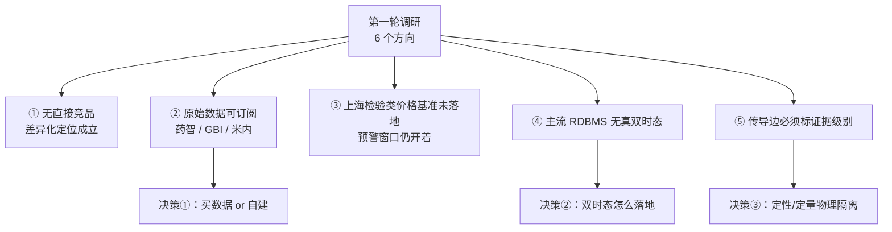

# 08 行业现状与竞品调研（第一轮快扫）

> **为什么做**：在写代码前确认「我们打算造的东西，是否已经有人造好、或能直接买到」。
> **怎么做**：6 个并行检索任务——A1 集约化服务商 / A2 SPD 与数据情报 / A3 DRG 与编码贯标 / B1 技术组件可复用性 / C1 政策落地与数据源 / D1 方法论校验。
> **来源分级**：官方一手（政府官网、企业官网、年报、论文原文、开源仓库）> 行业媒体 > 厂商宣传 > 无法核实。二手信息一律标【待核实】。

## 方法与局限（先声明，避免误用）

| 项 | 情况 |
|---|---|
| 检索通道 | 多个通用引擎被反爬（Bing 返回无关结果，Google / 搜狗 / DuckDuckGo / Mojeek 验证码）；实际主要依赖**政府与企业官网直抓、东方财富 F10 接口、经 Jina 代理的百度检索摘要** |
| 未取得 | 付费报告全文（IQVIA、众诚）、**招采子系统登录墙内的中选清单**、竞品产品的实际界面与算法、真实成交价格 |
| 因此 | 凡是"未见到某功能"的结论，语义是**"公开信息中未检索到"**，不等于"不存在"；标【待核实】者不得当事实使用 |

## 一、五条最重要结论

1. **没有找到直接竞品。** 集约化服务商（润达、塞力斯、迪安、金域）做的是"试剂供应 + 实验室运营"打包，**未见**"政策 → 检验项目 → 产品/SKU → 营收"这一层的分析与预警产品。
2. **但"买数据"这条路已经成熟。** 药智数据等商业库提供医械带量采购（中标企业 / 省份 / 价格 / 数量）、医用耗材中标价与挂网价、**医疗服务编码价格**、DRG 支付标准——我们原计划自建的一部分，可能订阅更划算。
3. **预警窗口还开着。** 上海**尚未**发布检验类价格基准（已落地的都是放射检查、超声、病理、体被系统、综合诊查等其他类别）。**"等上海出检验类价格基准"这个预警目标物仍在路上——这正是把系统建起来的窗口期。**
4. **集采牵头省份查明**（[03 文档](03-政策追踪-2026检验类立项指南与上海集采.md)的待确认项）：这是**六个省际联盟打包执行**，不是一个牵头省。
5. **方法论上唯一真正的系统性风险**：把"专家定性的传导边"当"定量结论"用。对策是把**定性结构与定量校准物理隔离**，并给每条边强制"证据级别"。

## 二、A 类：竞品与替代业态

### A1 集约化服务商（润达、塞力斯、迪安、金域）

| 公司 | 做什么 | 是否含决策支持 | 来源等级 |
|---|---|---|---|
| 润达医疗 | 集成综合服务、区域检验中心共建 | 未见政策/组合分析产品 | 官网（一手，功能层面） |
| 塞力斯医疗 | SPD、IVD 集约化、区域检验中心共建，自述"医疗集约化运营服务提供商" | 同上 | 官网 + F10 转述年报（二手） |
| 迪安诊断 / 金域医学 | 主业 ICL 第三方检测 + 实验室整体解决方案；金域另输出智慧实验室、数据要素、医检大模型 | 数据能力偏**实验室运营**层（库存/质控/成本/绩效） | 官网（一手） |

- **结论**：它们的数字化集中在"实验室运营"，**不在"政策 → 检验项目 → SKU"的传导层**；"未见"即是本轮的结论。
- **商业模式**：试剂耗材集中采购与统一配送差价 + 上游返利 + 增值服务费；历史含托管 / 按检验收入分成（ICL 外送分成约 30% 属行业估算，**【待核实】**）。
- **风险信号（对我们有利的反证）**：行业媒体在讨论"IVD 经销商是否因检验科集约化而出局"；集约化渠道商**合富中国因集采营收下滑 -27.83%**【二手媒体】——说明这个业态确实被集采冲击，痛点是真的。
- **对我方的定位**：润达/塞力斯更接近**"平台型上游 + 潜在替代者"**，不是同层竞品。**不要在实验室运营/SPD 上与之正面竞争。**

### A2 SPD 与医药数据情报

| 对象 | 覆盖什么 | 对本项目的价值 |
|---|---|---|
| **药智数据** | 医械带量采购库（中标企业/省份/价格/数量）、医用耗材中标（中标价/挂网价/参考价/限价/联动价）、**医疗服务编码价格**、DRG 试点医院支付标准 | **最贴近需求**，优先评估订阅 |
| GBI DEVINT / 米内网 | 器械招投标与中标采购、药品招投标数据库 | 次选 |
| 易联招采网 | 自述"全国医药招标采购中标数据查询平台"，面向中小经销商 | 值得核实（域名未确认，**【待核实】**） |
| SPD 服务商（国药控股、九州通等） | 面向**医院院内**供应链（采购/库存/用后结算），非经销商价格情报；九州通"骨科嫦娥"面向厂家/经销商 | 非本类需求，但医院侧是潜在渠道 |
| 众诚咨询、IQVIA 中国 | 本轮**未验证** | 待查 |

- **关键缺口**：省际联盟 IVD / 糖代谢集采的**中选企业与逐规格中选价格**发布在医保招采子系统登录墙内，商业库未必穿透 → **这部分仍须人工获取 + 自建留痕**。

### A3 DRG 成本与编码贯标

- **政策层齐备**，且已有官方工具：国家医保信息业务编码动态维护平台、省级"医保代码比对工具"。
- **DRG/成本厂商**（望海康信、誉方医管等）做到**项目成本 / 病种成本与医保盈亏**；**未见细到"检验科单指标"的"检验项目 ↔ 医保编码 ↔ 成本/收入"三层打通产品**【待核实】。
- **竞品/渠道**：慧铭佳"多码合一"引擎（偏耗材 UDI）、东华医为等承接"医保贯码 / HIS 接口改造"招标。
- **明确的待改造项**：LIS 与检验侧收费字典要"推倒重对"，叠加缺数减收（每项 10%、封顶 5 元）。
- **定性：渠道 > 竞品 > 机会**——厂商已握有医院医保科/检验科入口，可借力触达；而检验专科级的三方映射 + 成本/收入分析，公开信息中**未见成熟一手产品**。

## 三、B 类：技术组件可复用性

| 组件 | 许可证 | 判断 |
|---|---|---|
| **无面向"中文 IVD 检测指标 + 方法学 → 编码"的现成工具** | — | **必须自建**（印证 [04 文档](04-数据工程-SKU与检测项目映射.md) 的判断） |
| RELMA（LOINC 官方映射助手） | LOINC License（非开源） | Windows 专属，**官方将停用**，仅作参考 |
| UMLS Metathesaurus | UTS 许可 | 概念/同义词归一可用，**不是映射工具** |
| SNOMED CT | Affiliate License（部分国家收费） | 语义参考，非映射工具 |
| **XTDB** | MPL-2.0 | **推荐评估**：原生双时态 + 显式继承 SQL:2011，与本项目最契合 |
| **TerminusDB** | Apache-2.0 | **推荐评估**：语义图 + 版本化 + 时间旅行 |
| Datomic | Pro/Cloud 专有 EULA | 语义契合（as-of/since/history）但闭源，谨慎 |
| Palantir Foundry Ontology | 闭源商用 | 只作**范式参考**，不采用 |
| Microsoft GraphRAG | MIT | 政策文本 → 图抽取；**已进入维护模式** |
| Neo4j GDS | 待核实 | 图算法（传播/中心性）备用 |
| Cube / dbt Semantic Layer / Stardog / Ontotext GraphDB | 待核实 | 本轮**暂排除** |

**两个判断**：
- **真正的约束在数据许可，不在软件许可**——LOINC / UMLS / SNOMED 的使用受各自数据条款限制，比库本身的许可证更需要核对。
- **可直接复用的**：双时态内核（XTDB / TerminusDB）、图算法（Neo4j GDS）、抽取框架（GraphRAG）。**必须自建的**：领域本体扩展、中文 IVD 词典与"指标 + 方法学"映射规则、span 证据模型、人在环审核、传导因果模型、评分卡。

**许可证兼容性（依 [ADR 0002](../docs/decisions/0002-license-gpl3.md) 的要求核对）**：Apache-2.0 与 MIT 可与 GPL-3.0 组合；**MPL-2.0（XTDB）与 GPLv3 的组合依据是通用表述，需法律层面确认**【待核实】。

## 四、C 类：政策与数据源现状（对 03 文档的直接更新）

| # | 问题 | 结论 | 来源等级 |
|---|---|---|---|
| 1 | **上海是否已发布检验类价格基准** | **未见**。上海已公开的立项指南落地文件属其他类别：放射检查类（2025-04-29）、超声检查类（2026-01 起）、病理类（医保价采函〔2025〕160 号）、体被系统类、综合诊查类+部分护理类映射表（2026-06） | 官方（经检索摘要确认，间接） |
| 2 | **集采牵头省份** | **六个联盟打包执行**：结构心脏病封堵器＝**福建**（FDQLC-2025-1）、**体外诊断试剂＝安徽**（IVDLM—2024—01，约 28 省）、**糖代谢等生化类＝江西**、动脉瘤夹/止血材料＝**京津冀"3+N"（天津牵头**，LH-HD2025-1）、高频电刀＝**湖南** | 【待原文核实】（百科 + 行业报道） |
| 3 | 中选企业与价格清单 | 2026-07-28 由招采子系统发布（**需登录**）；第三方**无系统性汇总**，仅零星二手："28 省发光集采平均降价 52.6%"、"生化试剂最低 0.03 元"、安徽"拟中选价格公示"PDF 含个别品种价 | 【待确认】 |
| 4 | 各省落地进展 | 贵州 2026-09-07 转载指南、湖南 2026-09-15 公示多类映射表、福建设"立项指南"专栏、河北卫健委 2026-08-14 转发；国家医保局 **2026-09-30** 发《立项指南落地执行具体问题征集表》 | 官方/地方政府网站 |
| 5 | 后续批次与修订 | 检验类系**第 40 批、收官之作**（40 批全部编制完成）；两次征求意见（2026-03-11、2026-07）；现为"试行"版，9-30 起征集落地问题，**可能修订**；未检索到第 41 批 | 官方 + 新华网 + 新浪财经 |

**结论**：上海价格基准一旦出台，就是本项目预警能力的第一个真实考题；**目前仍在窗口期**。

## 五、D 类：方法论校验

| # | 我们的做法 | 文献/工业界结论 | 建议 |
|---|---|---|---|
| 1 | 本体驱动的语义层 + 决策逻辑外置 | 成立，医疗与土地等领域有成熟案例；**常见失败**是过度建模、把本体当规则引擎 | 保持**薄本体 + 稳定上层**，易变规则放传导边数据 |
| 2 | "样本极少 + 强机制"时先建结构、只在有数据处校准 | 一致：该场景文献选**因果图/因果映射 + 贝叶斯网络（专家先验）**，而非回归 | **把 BN/因果图参数明确标注为"专家先验/因果假设"**，不得写成拟合系数 |
| 3 | 双时态 + 不可覆盖断言 | 成熟模式；**但 SQL:2011 虽定义两维时间，主流 RDBMS 只落地事务时间维** | **真双时态需自建或选专用库**（见决策②） |
| 4 | 能力问题（CQ）倒推本体 | 有用但**易误用**：写成愿望清单、写完不回收、与本体无追溯 | **每条 CQ 附可执行验收查询**，直接充当溯源与回归集（可与 M16 回溯验证合并） |
| 5 | LLM 抽取 → 图算法发现 → LLM 翻译 | 有先例（GraphRAG 即此三段）；陷阱：抽取幻觉、**图算法给的是"相关"不是"因果"**、翻译层抹平不确定性 | 抽取边落来源与置信度；图算法产出标"结构发现"；翻译层保留引用与不确定性措辞 |

**一句话**：**为每条传导边/断言强制"证据级别"字段，并把"专家定性结构"与"数据校准数值"物理隔离**——这能防住本方案唯一真正的系统性风险。

## 六、对本项目设计的影响

| # | 调研发现 | 冲击对象 | 处置 |
|---|---|---|---|
| 1 | 无直接竞品，差异化成立 | 01 / 02 定位 | 维持 |
| 2 | 原始数据可订阅 | **06 文档 M1/M6 的工作量假设**（原假设"全靠自建抓取"） | **待决策①** |
| 3 | 上海价格基准未落地 | 03 的窗口期判断 | 维持，M14 预警目标物明确 |
| 4 | 牵头省份已查明 | 03 / discuss README 的待确认项 | **本轮已更新** |
| 5 | 主流 RDBMS 无真双时态 | **06 文档 M8 存储选型** | **待决策②** |
| 6 | 传导边需证据级别 + 定性/定量隔离 | **M12 / M13 设计** | **待决策③**（建议采纳，成本极低） |
| 7 | CQ 应可执行 | M4 本体定稿的验收方式 | 建议采纳 |
| 8 | 集采是双刃剑有文献支持 | 02 的"别只建单向边" | 维持 |

## 七、需要决策的三件事

1. **要不要先订阅商业数据**（药智数据等）。若能订阅到"省级挂网价/中标价 + 集采中选清单 + 医疗服务价格编码 + DRG 支付标准"，M1 采集与 M6 参考主数据的自建量会显著下降。代价：费用，且**订阅数据的再分发/入库权限需先确认**（GPL 与数据许可无关，数据许可是独立问题）。
2. **双时态怎么落地**：① 关系型 + **应用层双时态**（显式 `valid_from/valid_to` + `tx_from/tx_to` 列，自己保证），简单、无新依赖、与既有"关系型起步"决策一致；② **知识库侧用 XTDB**（原生双时态），业务库仍用关系型，查询"当时我们以为是什么"更自然，但引入第二个存储。
3. **是否接受"证据级别 + 定性/定量物理隔离"作为 M12 的硬设计**（我强烈建议接受）。

## 八、待核实清单（不得当事实使用）

- 集约化服务商的确切分成比例、年报与招股书正文（web_fetch 未能解析 PDF）。
- 各联盟牵头省份与文件号（来源为百科与行业报道，**需原文核实**）。
- 中选清单的零星价格数字（"52.6%""0.03 元""496.5 元"）。
- 众诚咨询、IQVIA 中国对集采中选价与医疗服务价格的覆盖情况。
- 药智/米内/GBI/易联招采的订阅价格（官网未公开）与**数据再分发条款**。
- 易联招采网的官方域名。
- MPL-2.0 与 GPLv3 组合的法律依据（FSF 官方页抓取超时）。
- Cube / dbt / Stardog / Ontotext GraphDB 许可证条款、Neo4j GDS 许可（未逐页核对）。
- 学术侧：药品短缺与供应链风险传播的具体论文（arXiv 超时、Semantic Scholar 429）。

## 九、下一轮建议

第一轮的结论足以支撑"继续按现设计走"（无直接竞品、窗口期仍在）。若要做第二轮，优先级排序：

1. **药智数据等商业库的实际覆盖与条款**（直接影响决策①，且能省最多工）——建议由你直接询价与索取数据字典。
2. **招采子系统登录后的中选清单**（必须人工，且是所有分析的核心输入）。
3. **XTDB / TerminusDB 的实操评估**（直接影响决策②）——可在 M8 存储落地前做一个小原型。
4. 集约化服务商的年报正文（确认它们的数据能力边界）。

---

## 变更记录

| 日期 | 变更 |
|---|---|
| 2026-10-07 | 第一轮调研：A/B/C/D 四类 6 个方向；查明集采牵头省份；确认上海价格基准未落地；识别三项待决策 |
