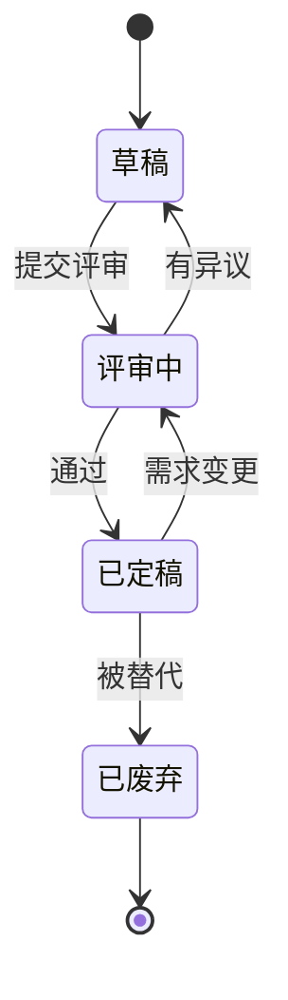

# 00 文档体系与编写规范

> 本文件规定**什么放哪里、怎么编号、什么时候算定稿**。它是 `docs/` 的元文档，自身也需要评审。

## 一、两类文档的分工（最重要的区分）

| | `discuss/` | `docs/` |
|---|---|---|
| 内容 | **过程**：推理、试错、被否决的方案、当时的犹豫、待确认问题 | **定稿**：结论、结构、接口、验收标准 |
| 语气 | 讨论式（"我倾向于…""这里不确定"） | 断言式（"系统采用…"） |
| 时效 | 长期保留，可标注过期 | 有版本号，修订需留痕 |
| 读者 | 作者与协作者（帮我回忆"为什么"） | 实施者、评审者、未来的自己与新领域 |

**为什么不合并**：可复用的从来不只是结论，还有**"问题 → 结构 → 数据 → 结论"这条推理链**。删掉过程，第二个领域只能抄表结构、抄不到判断。

## 二、从讨论到定稿的提升规则

一条内容可以从 `discuss/` 提升到 `docs/`，需同时满足：

1. **结论稳定**——没有再被推翻的迹象；
2. **有据可依**——依据的原始资料已落盘（如 `discuss/sources/`）；
3. **可实施**——实施者不必再问作者就能动手；
4. **已进 ADR 或无需 ADR**——涉及架构取舍的必须留下决策记录。

**不满足时不得提升**，宁可留在 discuss 里标【待确认】。

## 三、编号与命名

- 定稿文档：`NN-中文标题.md`，两位数字，序号不复用（作废保留占位）。
- 决策记录：`decisions/NNNN-英文短标题.md`，四位数字，只增不改。
- 模块详细设计篇幅大时，拆为 `03-模块详细设计-M09-映射引擎.md` 形式，主文档保留索引。
- 领域资产不叫"文档"，放 `domains/<domain>/`，由 `docs` 引用而不复制。

## 四、头部字段（Front-matter，必填）

```yaml
---
title: 系统概要设计
created: 2026-10-06
updated: 2026-10-06
status: 已定稿        # 草稿 | 评审中 | 已定稿 | 已废弃
version: 0.1          # 定稿文档必填；每次实质性修订 +0.1
---
```

## 五、状态流转



**只有 `已定稿` 的文档可以对外引用。** 引用 `discuss/` 的内容时须说明其在讨论中。

## 六、ADR（架构决策记录）规范

一篇 ADR 只记**一个**决策，包含六段：

| 段 | 写什么 |
|---|---|
| 状态 | 提议 / **已采纳** / 已废弃 / 被替代（含替代者编号） |
| 背景 | 当时面对什么问题、有哪些约束（**不写事后诸葛**） |
| 决策 | 一句话说清选了什么 |
| 理由 | 为什么它比替代方案好 |
| 后果 | 正面收益 **与代价**（必须诚实写代价） |
| 被否决的替代方案 | 各是什么、为什么没选 |

**只增不改**：决策改变时新开一篇，并在旧篇标注"被 NNNN 替代"。

## 七、图表与术语

- **图表一律用 mermaid 代码块**（flowchart / stateDiagram / sequenceDiagram / erDiagram / gantt 等），不用 ASCII 字符拼接的图，不用截图替代。
- 表结构优先用 `erDiagram` 表达关系，字段细节再用表格。
- **术语第一次出现即解释**；跨文档共用的术语汇总进 `05-术语表`。
- 政策/法规类专有名词（"加收项""联检折扣""议价红线"）必须给出**业务语言对照**——审核界面的用户是产品/商务专家，不是政策专家。

## 八、修订留痕

每份文档文末维护：

| 日期 | 版本 | 变更 |
|---|---|---|
| 2026-10-06 | 0.1 | 初稿：文档分工、提升规则、编号、ADR 规范 |
