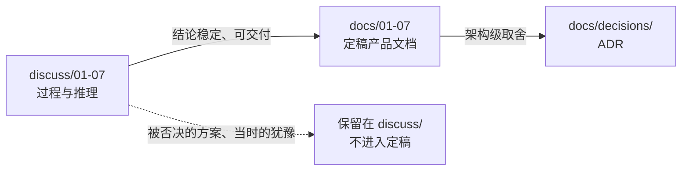

# docs — 定稿产品文档

> **本目录放"已定稿"的文档**：有编号、有版本、可交付、可对外。
> **`discuss/` 放过程**（含未定结论与被否决的方案）。两者的分工与提升规则见 [00-文档体系与编写规范](00-文档体系与编写规范.md)。

## 文档清单

| 编号 | 文档 | 内容 | 状态 |
|---|---|---|---|
| [00](00-文档体系与编写规范.md) | 文档体系与编写规范 | 编号规则、头部字段、状态流转、ADR 规范、图表规范 | 🟩 已成文 |
| 01 | 系统概要设计 | 三层架构、模块划分与交互、数据流、部署形态 | ⬜ 待编写 |
| 02 | 数据架构与表结构 | 数据集清单、表结构、字段字典、主键与约束、迁移策略 | ⬜ 待编写 |
| 03 | 模块详细设计 | 逐模块（M1–M17 + C1/C2）的接口、流程、算法、异常 | ⬜ 待编写 |
| 04 | 接口与数据契约 | 模块间数据集契约、注册表 schema、状态机定义 | ⬜ 待编写 |
| 05 | 术语表 | 业务术语 / 政策术语 / 技术术语三合一 | ⬜ 待编写 |
| 06 | 部署与运维 | 环境、配置项、任务编排、备份与恢复 | ⬜ 待编写 |
| 07 | 测试与验收 | 映射验收标准、回溯测试方法、抽样评测 | ⬜ 待编写 |
| [decisions/](decisions/README.md) | 架构决策记录（ADR） | 重大决策的背景、理由与被否决方案 | 🟩 已启用 |

## 与讨论文档的对应关系

定稿文档不是另起炉灶，而是从讨论文档**收敛**而来：

- 表结构的具体来源是 [discuss/04](../discuss/04-数据工程-SKU与检测项目映射.md)（设计）与 [discuss/06](../discuss/06-功能模块设计.md)（模块边界）。
- 架构取舍的来源是 [discuss/01](../discuss/01-总体方向与架构选型.md) 与 [discuss/07](../discuss/07-平台化预留与渐进明细.md)。
