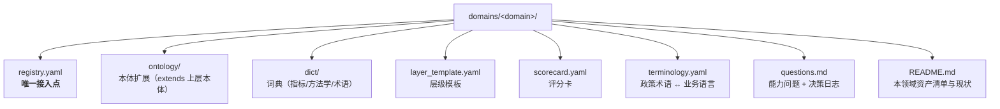

# domains/ — 领域包

> 一个领域 = 一个子目录。领域包**只声明、不改内核**，通过 `registry.yaml` 把自己接入 `core/`。

## 一、已规划与设想中的领域

| 目录 | 领域 | 状态 | 复用什么、新增什么 |
|---|---|---|---|
| `ivd/` | 体外诊断试剂**贸易** | 🟨 骨架已建 | 首个领域，建立内核 |
| （设想）`ivd_supply/` 或并入 `ivd/` | 体外诊断试剂**供应链管理** | ⬜ 台阶 2 | **同域延伸**：复用影响图与映射；新增供需、库存与履约关系 |
| （设想）`geopolitics/` | 国际关系 / 国际舆情 / 贵金属关联 | ⬜ 台阶 3 | **跨域**：复用"事件 × 主体 × 传导"内核；新增语料域与主体类型 |

**顺序带来的判断**：第二、三个领域的差异集中在**主体与关系**（组织、角色、供需、事件、传导），而非"证照/编码"。因此内核中优先做好的是**影响图引擎与通用主体关系建模**，`License`/`Registration` 这类只留在 IVD 领域包。

## 二、领域包目录约定



除 `registry.yaml` 外，其余文件**按实施进度逐步建立**，不为占位而建空文件。

## 三、新增一个领域的流程（台阶 2 的实操）

1. 新建 `domains/<domain>/`，写 `README.md`（能力问题、与已有领域的差异）。
2. 写 `registry.yaml`，声明本体扩展、编码体系、词典、层级模板、评分卡、术语字典。
3. 若现有注册表 schema 无法表达新领域 → **先修订 schema，再改内核读法**（不得让内核直接认新领域的概念）。
4. 在 `config/config.yaml` 的 `project.active_domains` 里并列新领域。
5. 只有在这一步之后，才允许**回看两份真实实现**去抽公共接口（台阶 2 的抽象动作）。

## 四、隔离性检查

```bash
# domains/<domain>/ 之外不得出现该领域的专有字面量（以 ivd 为例）
grep -rniE 'ivd|nhsa|smpaa|医保|检测项目|集采' core/ apps/ --include='*.py'
```
